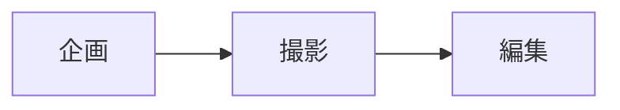

# Markdown 記法リファレンス

ノートとキャンバスのテキストカードで使える記法の完全版です。標準の Markdown（GFM）に加え、Constella 独自の拡張があります。計画ページは専用の[旅程記法](./plan-syntax)が主体で、このページの記法は見出し・リスト・リンク（添付の展開）など一部のみ使えます。

## 基本

| 記法 | 結果 |
| --- | --- |
| `# 見出し` 〜 `### 見出し` | 見出し 1〜3（エディタのツールバー / 右クリックメニューからも） |
| `**太字**` / `*斜体*` / `~~取り消し~~` | **太字** / *斜体* / ~~取り消し~~ |
| `` `コード` `` | インラインコード |
| `- 項目` / `1. 項目` | 箇条書き / 番号付きリスト |
| `- [ ] やること` / `- [x] 済み` | チェックリスト（プレビュー上でクリックしてチェック切替可） |
| `> 引用` | 引用 |
| `[表示名](https://…)` | リンク（アプリ内では OS のブラウザで開く） |
| `` | 画像 |
| `---` | 水平線（ノートではスライドの区切りにもなる） |
| `\| A \| B \|` | 表（ツールバーの「表」で雛形挿入） |

```` md
```js
console.log('コードブロックは言語名を付けるとハイライトされます')
```
````

::: tip 改行について
Constella は Markdown 標準どおり、単なる改行は段落内で連結されます。行を分けたいときは**行末にスペース 2 個**か `\` を置くか、空行で段落を分けてください。
:::

## Constella 拡張

### ハイライト

```md
==ここが重要==
```

==ここが重要== のように黄色のマーカーになります。

### コールアウト

GitHub と同じ書き方です。`NOTE` / `TIP` / `IMPORTANT` / `WARNING` / `CAUTION` の 5 種類。

```md
> [!NOTE] 補足
> ここに本文。複数行の場合は続けて > を書きます。

> [!WARNING] 注意
> 締切は金曜です。
```

右クリックメニューの「コールアウト (NOTE)」で雛形が入ります。

### 数式（KaTeX）

```md
インライン: $E = mc^2$

$$
\int_0^1 x^2 \, dx = \frac{1}{3}
$$
```

`$` の直後・直前にスペースを入れると数式扱いになりません（`$ 100` のような金額表記を誤認しないため）。

### Mermaid 図

```` md

````


フローチャート・シーケンス図・ガントなど Mermaid が対応する図はすべて描けます。

### wiki リンク（キャンバスカードへのジャンプ）

半角の角かっこ 2 つでキャンバスの**カードタイトル**を囲むと、クリックでそのカードへジャンプするリンクになります。

```md
詳細は [[撮影スケジュール]] を参照
```

### 参照リンクと脚注

```md
本文中のリンク[Constella][1]と脚注[^1]。

[1]: https://github.com/yyamada722/constella
[^1]: 脚注の本文
```

## 添付ファイルとローカル参照

| 記法 | 意味 |
| --- | --- |
| `` | アプリに取り込んだ画像。画像を貼り付け / 挿入すると自動でこの形式になる |
| `[名前](idb:…)` | 取り込んだ PDF などの添付 |
| `[名前](local:C:\path\to\file.pdf)` | **サーバー参照** — 取り込まず、NAS やローカルのパスだけを保存。クリックで OS の既定アプリで開く |

`idb:` / `local:` の ID やパスは手で書くより、ツールバーの「添付」「サーバー参照」ボタンや貼り付けで挿入するのが確実です。

## テンプレートと日付

右クリックメニューから挿入できます。

| 項目 | 内容 |
| --- | --- |
| 今日の日付 | `2026-08-22(土)` の形式 |
| 現在日時 | `2026-08-22(土) 14:05` |
| 議事録テンプレート | 参加者 / 目的 / 決定事項 / TODO / メモ の見出し構成 |
| 日報テンプレート | 今日やったこと / 明日やること / 気づき・メモ |

## エディタの操作

| キー | 動作 |
| --- | --- |
| `Ctrl+B` / `Ctrl+I` / `Ctrl+E` / `Ctrl+K` | 太字 / 斜体 / インラインコード / リンク |
| `Ctrl+Shift+X` | 取り消し線 |
| `Enter`（リスト内） | 同じ種類の項目を継続。番号は自動で増える。空の項目で Enter するとリストを抜ける |
| `Tab` / `Shift+Tab` | リストのインデント / アウトデント。表の中ではセル移動（行末の Tab で行追加） |
| `Ctrl+V` | 画像 → 画像として挿入。URL を選択中 → リンク化。HTML / Excel の表 → Markdown に変換 |
| `Ctrl+Shift+V` | 変換せずプレーンテキストで貼り付け |
| `Ctrl+F` / `Ctrl+H` | ノート内の検索 / 置換 |

関連: [ノートの使い方](/guide/notes) / [ショートカット一覧](/guide/shortcuts)
