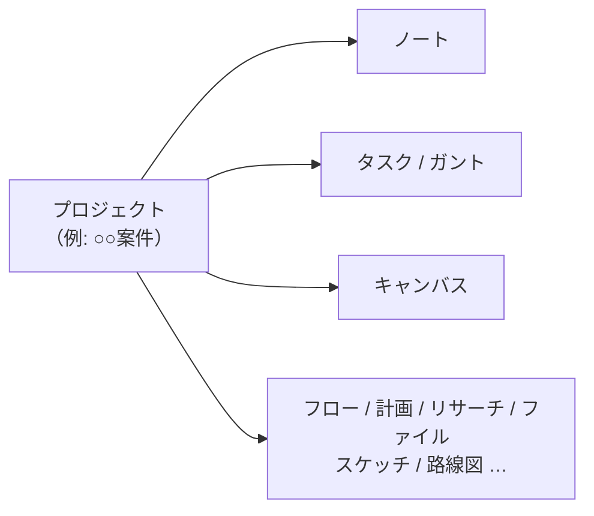

# はじめに

Constella（コンステラ）は、ノート・タスク・図・旅程などをひとつの場所で管理する情報整理アプリです。書き留める（ノート）、段取りする（タスク・ガント）、広げて考える（キャンバス・フロー）、出張を組む（計画）——を行き来しながら使えます。

## 画面のなりたち

左端の**サイドバー**でページを切り替えます。サイドバーの最上部にあるのが**プロジェクト切替**です。

すべてのページの内容は「いま選んでいるプロジェクト」に属します。案件や仕事のまとまりごとにプロジェクトを分けておくと、切り替えるだけでノートもタスクもキャンバスもまるごと切り替わります。プロジェクトはフォルダーでグループ化でき、終わったものは**アーカイブ**して一覧から退避できます。

| ページ | できること |
| --- | --- |
| ダッシュボード | 全プロジェクトを横断してタスクの状況を一望 |
| ノート | Markdown でメモ・議事録・ドキュメントを書く |
| タスク | カンバン / ガント / カレンダーでタスク管理 |
| フロー | ノードをつないで段取りを図にし、そのままタスク化 |
| 計画 | テキスト記法で出張・ロケハンの旅程を組む |
| リサーチ | 内蔵ブラウザで調べ物とブックマーク整理 |
| ファイル | 写真・PDF・動画などをプロジェクト横断で管理し、ノートやタスクから参照 |
| キャンバス | カード・矢印・手書きを自由に配置する無限ボード |
| スケッチ | 手書き専用のホワイトボード |
| 路線図 | プロジェクトの進み具合を路線図のように俯瞰 |
| 検索 | すべてのページを横断検索 |

## 最初の 5 分

1. サイドバー上部の**プロジェクト切替**から「新しいプロジェクト」を作ります。
2. **ノート**ページで最初のノートを書いてみます。Markdown が使えます（見出しは `#`、リストは `-`）。
3. **タスク**ページでボードを作り、タスクを追加します。ステータスはクリックで「未着手 → 進行中 → 完了」と切り替わります。

## 困ったら

- キーボードの `?` でいつでもこのヘルプが開きます。
- `Ctrl+Z` はどの画面でも「元に戻す」です。削除もほとんど取り消せます。
- `Esc` は開いているメニューや選択を閉じます。迷ったらまず Esc。

> [!TIP]
> データはすべてお使いの PC の中に保存されます。定期的なバックアップの方法は「データとバックアップ」の章をご覧ください。
