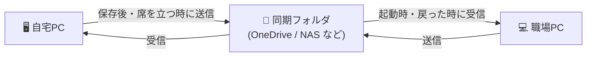
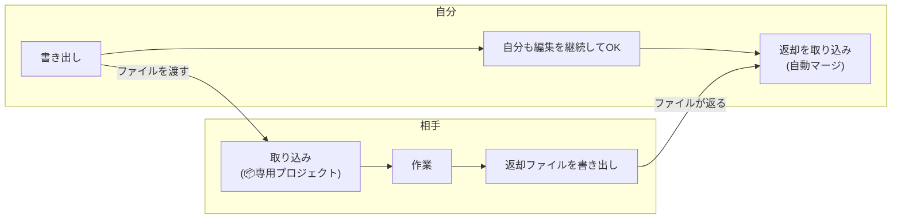

# 同期と受け渡し

Constella のデータを PC の外へ持ち出す方法は 4 つあります。まず「どれを使うべきか」から。

| やりたいこと | 使う機能 | 場所 |
|---|---|---|
| **自分の複数の PC** で同じデータを使いたい（自宅⇔職場など） | 他のマシンと同期 | 設定モーダル |
| **他の人**に一部の作業を渡して、続きをやってもらいたい | 作業ファイル（受け渡し） | 設定メニュー |
| 同じ部屋の iPad やスマホから**閲覧・軽い編集**をしたい | 外部アクセス（LAN 公開） | 設定メニュー |
| 万一に備えて**控え**を取りたい / PC を買い替えたい | バックアップ書き出し | 設定メニュー |

> [!TIP]
> 「同期」は全データを丸ごと、「受け渡し」は選んだ項目だけ。同期は自分専用、受け渡しは他人と、と覚えてください。

---

## 他のマシンと同期（同期フォルダ）

OneDrive / Dropbox / Google Drive / NAS などの**共有フォルダを郵便受け**にして、複数の PC で同じデータを使う機能です。サーバーもアカウントも不要で、各 PC が同じフォルダを見るだけで成立します。

### 初回セットアップ

**1 台目（今使っている PC）:**

1. 設定モーダル（サイドバー下部 → **外観・コードテーマ…**）を開く
2. **他のマシンと同期** →「フォルダを選択」で、クラウドドライブ内に作った空のフォルダ（例: `OneDrive/Constella同期`）を指定
3. 自動でオンになり、現在のデータがフォルダへ送られます

**2 台目:**

1. Constella をインストールして起動
2. 同じ手順で**同じフォルダ**を指定
3. 「この同期フォルダには既にデータがあります」と聞かれるので、**「同期フォルダの内容を取り込む（推奨）」**を選ぶ — 1 台目のデータがそのまま入ります

> [!IMPORTANT]
> 2 台目で「このPCの内容で開始」を選ぶと、フォルダ側が 2 台目のデータで上書きされます（1 台目のデータは退避されるので消えはしません）。通常は「取り込む」を選んでください。

### ふだんの使い方

**何もしなくて大丈夫です。** 次のタイミングで自動的に同期します。

- アプリの**起動時**（別の PC の変更があれば取り込んでから開く）
- **編集して少し経ったとき**、および**ウィンドウから離れた瞬間**（送信）
- **ウィンドウに戻った瞬間**（受信チェック）

急ぎのときは右下の**同期ボタン**か、設定モーダルの「今すぐ同期」で即時に同期できます。

### 状態表示の意味

設定モーダルの同期欄に現在の状態が出ます。

| 表示 | 意味 |
|---|---|
| 同期済み | 最新です。日時は最後に送受信した時刻 |
| 送信中… / 受信中… | 転送中。待つだけで OK |
| クラウドの転送待ち | クラウドドライブがまだファイルを運んでいる途中。自動で再試行します |
| 競合 | 両方の PC で変更があった状態。画面上部のバナーで選択します（下記） |
| 同期フォルダにアクセスできません | フォルダが見えない（クラウドドライブ停止・NAS オフラインなど） |

### 競合になったら

「1 台ずつ順番に使う」ぶんには競合は起きません。うっかり**両方の PC で編集してしまった**ときだけ、画面上部にバナーが出ます。

- **「◯◯を採用」** — 選ばなかった側のデータは、自動でバックアップ（`設定メニュー → バックアップ` と同じ復旧候補）に退避されます。**どちらを選んでもデータは消えません。**
- 迷ったら、変更量が多かった側を採用 → もう片方の変更は復旧候補から手で拾う、が確実です。

### うまくいかないとき

| 症状 | 原因と対処 |
|---|---|
| 画像・動画だけ表示されない | クラウドの転送待ちです。数分待つと自動で取り込まれます |
| 「クラウドの転送待ち」が長い | クラウドドライブアプリ（OneDrive 等）が同期一時停止になっていないか確認 |
| 競合バナーが頻繁に出る | 前の PC を閉じる（またはウィンドウを切り替える）前に数秒待ち、送信を済ませてから移動してください |
| 別ネットワークの PC と同期したい | クラウドドライブ経由なら場所を問わず使えます。NAS 直指定の場合は同じネットワーク（または VPN/Tailscale）が必要です |

### 制限と注意

- **2 台で同時に編集する使い方は想定していません**（競合になります）。同時に使いたい場合は「外部アクセス」を検討してください。
- 「サーバー参照」で登録したファイル（`local:` 参照）は**パスだけ**同期されます。両方の PC から見える NAS のパスならそのまま開けます。
- 同期フォルダの中身（`constella.db` / `media/` など）は手で編集・削除しないでください。

---

## 作業ファイル（受け渡し）

3DCG ツールの**シーンファイルの受け渡し**と同じ感覚で、選んだ作業単位を 1 つのファイルにして他の人に渡し、**続きを作業してもらって返してもらう**機能です。渡している間、**自分も同じ項目を編集して構いません** — 返却時に双方の変更を自動で突き合わせます。

### 渡す側の手順

1. 渡したい項目があるプロジェクトを開き、**設定メニュー → 作業ファイル(受け渡し)…**
2. 渡す項目にチェック — ノート（フォルダごとでも個別でも）/ タスクボード / キャンバスボード / フロー / 計画 / リサーチ / スケッチ
3. ファイル名を付けて**書き出し** → 生成された `.json` ファイルを相手に送る（メール・チャット等、手段は自由）

- 選んだ項目が参照している**画像・PDF・添付ファイルは自動で同梱**されます。ファイルが大きくなりすぎる場合は**「動画を同梱しない」**にチェック（相手側では動画だけ欠落表示になります）。
- 貸し出した記録は同じ画面の**「貸し出した作業ファイル」**に残り、返却済みかどうかが分かります。

### 受け取る側の手順

1. **設定メニュー → 作業ファイル(受け渡し)… → ファイルを選択**で受け取ったファイルを開く
2. **📦 の付いた専用プロジェクト**として追加されます。自分の既存データには一切影響しません
3. 通常どおり作業する（ノート編集・タスク追加・カード配置など何でも可）
4. 終わったら同じ画面の**「返却ファイルを書き出し」**（📦 プロジェクトを開いていると上部に表示されます）→ 生成されたファイルを送り返す

### 返却を取り込む（自動マージ）

返却ファイルを「ファイルを選択」で開くと、**渡した時点からの双方の変更**を項目ごとに突き合わせて取り込みます。

| 状況 | 結果 |
|---|---|
| 相手だけが変更・追加・削除した項目 | そのまま反映 |
| 自分だけが変更した項目 | 自分の版を維持 |
| **両方**が同じ項目を変更していた | **競合** — 一覧が表示され、項目ごとに「相手 / 自分」を選択（初期値は相手） |

- マージは 1 回の操作として記録されるので、結果が気に入らなければ **Ctrl+Z で丸ごと取り消せます**。
- 取り込み結果には「更新 ◯ / 追加 ◯ / 削除 ◯」の件数が表示されます。

### 注意とヒント

- 返却の突き合わせには**貸出時の記録**（書き出した PC に保存）を使います。返却は**書き出したのと同じ PC**（または同期フォルダでつながった自分の PC）で取り込んでください。
- 1 つの作業ファイルは**1 人に渡す**運用を想定しています。同じファイルを複数人に配って複数の返却を受けると、2 つ目以降のマージで競合が増えます。
- 相手が同じ作業ファイルを 2 回取り込もうとするとエラーになります（重複防止）。
- 「サーバー参照」（`local:`）のファイルはパスだけが渡るため、相手からは開けないことがあります。渡したいファイルは通常の取り込み（ライブラリへの追加）にしておくのが確実です。

### よくある質問

- **相手も Constella が必要?** — はい。閲覧だけしてほしい場合は、キャンバスの共有 HTML 書き出しや PDF 書き出しを使ってください。
- **渡している間に自分がその項目を消したら?** — 相手が触っていなければ削除が維持されます。相手が変更していた場合は競合として確認されます。
- **返却前に途中経過をもらったら?** — そのまま取り込めます。マージ後も貸出記録は残るので、最終版の返却も同じように取り込めます。
